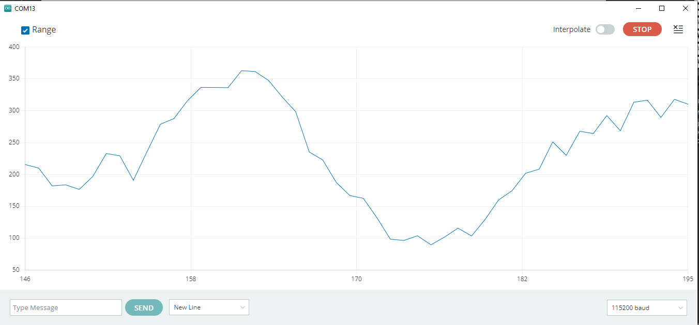
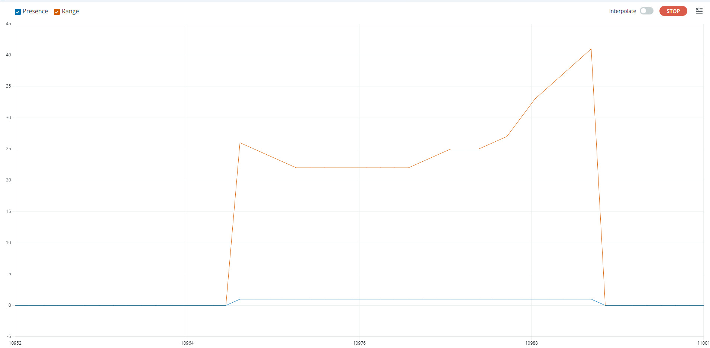
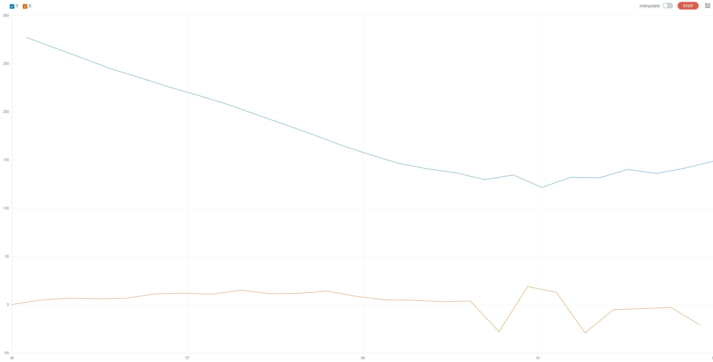

# ICUx0201 Arduino library
This arduino library for the [TDK/Invensense ICUx0201 Time-of-Flight sensors](https://invensense.tdk.com/smartsonic/).
The ICU-x0201 devices are miniature, ultra-low power, long-range ultrasonic Time-of-Flight (ToF) transceivers.
This library supports ICU-10201, ICU-20201 and ICU-30201 devices.

# Software setup
Use Arduino Library manager to find and install the ICUx0201 library.

# Hardware setup
There is currenlty no Arduino shield for the ICU-x0201 sensors.
The wiring must be done manually between the Arduino motherboard and the Ultrasonic ToF EVK board.
The below wiring description is given for an Arduino Zero board:

|Arduino Zero|Ultrasonic ToF EVK board|
| --- | --- |
| 3V3          | J5.1           |
| 5V           | J10.19         |
| GND          | J5.3           |
| MISO=SPI.1   | J5.11          |
| MOSI=SPI.4   | J5.9           |
| SCK=SPI.3    | J5.5           |
| CS0=DIG.10   | J5.12          |
| INT1_0=DIG.2 | J5.8           |

Note: SPI Chip Select can be mapped on any free digital IO, updating the sketches accordingly.
      INT1 interrupt line can be mapped on any free interruptable IO, updating the sketches accordingly.

On Ultrasonic ToF EVK, connect EN_1v8 to 3v3

|3v3|EN_1v8|
| --- | --- |
| J1.7 | J1.14 |

The ICU-x0201 sensor module must be connected with a flex to the J3 connector (Device 0 port).

## Adding a second sensor

This library includes a triangulation sketche requiring 2 ICU10201 sensors.
The second ICU10201 sensor module must be connected with a flex to the J4 connector (Device 1 port).  
Other additional signals are required:

|Arduino Zero|Ultrasonic ToF EVK board|
| --- | --- |
| CS1=DIG.9    | J5.16          |
| INT1_1=DIG.3 | J5.2           |

# Library API

## Create ICUx0201 instance


**ICUX0201_GeneralPurpose(SPIClass &spi_ref,uint8_t cs_id,uint8_t int1_id)**
Create an instance of the ICUx0201 that will be accessed using the specified SPI. The IO numbers to be used as chip select and int1 must be specified.
The ICUx0201 instance will be programmed with the General Purpose firmware.

```C++
ICUX0201_GeneralPurpose ICU(SPI,10,2);
```

**ICUX0201_Presence(SPIClass &spi_ref,uint8_t cs_id,uint8_t int1_id)**
Create an instance of the ICUx0201 that will be accessed using the specified SPI. The IO numbers to be used as chip select and int1 must be specified.
The ICUx0201 instance will be programmed with the Presence Detection firmware.

```C++
ICUX0201_Presence ICU(SPI, 10, 2);
```


## Initialize the ICUx0201
Call the begin method to execute the ICUx0201 initialization routine. 

**int begin()**

Initializes all the required parameters in order to communicate and use the ICU-x0201 sensor.

```C++
ICU.begin();
```

## Start sensor

**int free_run()**

This method configure and starts the sensor in free run mode with maximum detection range and a measure interval set to 100ms.

```C++
ICU.free_run();
```

**int free_run(uint16_t max_range_mm, uint16_t interval)**

This method configure and starts the sensor in free run mode with a detection range and a measure interval provided by the user.
Maximum detection range is in mm, maximum values are 750 mm for ICU-10201, 4000 mm for ICU-20201 and 7000 mm for ICU-30201. 
Measure interval is in ms. 

```C++
ICU.free_run(500, 200);
```


## Get Sensor Data

**bool data_ready()**

The function returns true if a measure is available, false if not.

```C++
if(ICU.data_ready())
{
    Serial.println("A measure has completed");
}
```

**uint8_t get_iq_data(ch_iq_sample_t&ast; iq_data, uint16_t nb_samples)**

This method get the sensor raw I/Q data.
The function returns 0 when successful (non-zero value if an error occurs).
*iq_data* must be an array of *ICU_MAX_NUM_SAMPLES* elements of *ch_iq_sample_t* (see definition below)

```C++
ch_iq_sample_t raw_data[ICU_MAX_NUM_SAMPLES];
uint16_t nb_samples;
/* Get raw data from the sensor */
ICU.get_iq_data(raw_data,&nb_samples);
Serial.println("ICU Raw Data");
for (int count = 0; count < nb_samples; count++) {
  /* output one I/Q pair per line */
  Serial.print(raw_data[count].q);
  Serial.print(",");
  Serial.println(raw_data[count].i);
}
```

**ch_iq_sample_t**

This structure is used by the ICUX0201 driver to return raw I/Q sensor data. Available data is:
|Field name|description|
| --- | --- |
| q | Q component of sample |
| i | I component of sample |


## Get range with ICUX0201_GeneralPurpose instance

**float get_range(void)**

This method returns the detected range in mm.
Range is set to 0, if no target is found.

```C++
float range_mm = ICU.get_range();
Serial.print("Range(mm):");
Serial.println(range_mm);
```

## Get range and presence with ICUX0201_Presence instance

**uint16_t get_range(void)**

This method returns the detected range in cm.
Range is set to 0, if no target is found.

```C++
uint16_t range_cm = ICU.get_range();
Serial.print("Range(cm):");
Serial.println(range_cm);
```

**bool get_presence(void)**

This method returns the presence flag.
Presence flag is set to 1, when a target is found.

```C++
bool presence = ICU.get_presence();
Serial.print("Presence:");
Serial.println(presence);
```

## Using 2 sensors

**ICUX0201_dev_GeneralPurpose(SPIClass &spi_ref, int cs_id, int int1_id)**

This method creates an instance of ICUx0201 device with General Purpose firmware, using provided SPI instance and chip select, and specified pin for interrupt.

```C++
ICUX0201_dev_GeneralPurpose dev0(Wire, CHIRP_DEVICE0_I2C_ADDR, 2, 8, 10);
```

**ICUX0201_GeneralPurpose(ICUX0201_dev_GeneralPurpose& dev0,ICUX0201_dev_GeneralPurpose& dev1)**

This method creates a group of ICUx0201 devices with dev0 & dev1.  
In order to work together, ICUx0201 devices must be part of a sensor group.

```C++
ICUX0201_dev_GeneralPurpose dev0(SPI, 10, 2);
ICUX0201_dev_GeneralPurpose dev1(SPI, 9, 3);
ICUX0201_GeneralPurpose ICU(dev0,dev1);
```

**int start_trigger(uint16_t range_mm)**

When using multiple ICUX0201 sensors, they must be synchronized to work together.
This method starts first sensor as "emitter and receiver" and second sensor as "receiver only".
Measurements will be triggered using the interrupt pins.
A max range could be specified in mm (default is max range).

```C++
ICU.start_trigger(500);
```

**void trig(void)**

This method is used to trigger a measurement for a group of ICUX0201 sensors.

```C++
ICU.trig();
```

**bool data_ready(int sensor_id=0)**

The function returns true if a measure is available for the specified sensor id, false if not.

```C++
if(ICU.data_ready(0)&&ICU.data_ready(1))
{
    Serial.println("A measure has completed");
}
````

**int triangulate(const float distance_between_sensors_mm, float& x, float& y, float offset=0)**

This method is used to compute the plane triangulation of a target using ICU10201 measurements.
To get a valid triangulation using this method, ICU10201 sensors must be placed at a certain distance and must be "looking" into the same direction.
The distance between the sensors must be specified as an input, *x* and *y* are the triangulation ouputs.
The *x* output corresponds to the target "left-right" position, while *y* corresponds to the distance of the object.
The method returns negative value if the triangulation computation is impossible (no target or multiple targets detected,...), 0 otherwise.
A distance offset might be specified in case measured sensor ranges are not aligned.

```C++
float x,y;
if(ICU.triangulate(DISTANCE_BETWEEN_SENSORS_MM,x,y)==0)
{
  Serial.print("X:");
  Serial.println(x);
  Serial.print(" Y:");
  Serial.println(y);
}
```


# Available Sketches

**ICUx0201_TargetDetection**

This sketch initializes an ICUx0201, and starts the Time-of-Flight in free run mode. The detected range is printed on the Serial monitor, and can be plotted with the Serial plotter.



**ICU20201_PresenceDetection**

This sketch initializes an ICU20201, and starts the Presence Detection algorithm. When a target is detected, the presence flag is set to 1 and the target range is computed.
Presence flag and target range are printed on the Serial monitor, and can be plotted with the Serial plotter (Due to automatic scaling of Serial plotter, the range should be disabled to observe presence flag).



**ICUx0201_RawData**

This sketch initializes an ICUx0201, and starts the Time-of-Flight in free run mode. For each sample, the raw I/Q data is printed on the Serial monitor.

**ICU10201_Triangulation**

This sketch initializes a group of two ICU10201 sensors, and starts the triangulation. For each sample, X and Y target coordinates are printed on the Serial monitor.



# Additionnal Sketches

**MicroROS_Publisher**

This sketch initializes the ICUx0201 device and the microROS Arduino environment to log target range sensor data. Sensor data is published in a Range structure. For more information, refer to MicroROS_README.md.
